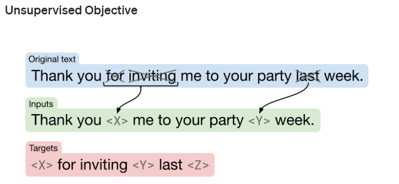

# Hit Machine
### Generating Lyrics and Chords using T5
_Ziv Keidar and Eitan Bentora_

In this Project we created a module writing original chords and lyrics using
[HuggingFace's T5](https://huggingface.co/docs/transformers/model_doc/t5 "HuggingFace-T5").  
The models in the project were trained on a dataset we created by web-scraping the website
[e-chords](https://www.e-chords.com/chords/ "e-chords"). Our goal in this project was to take a step in the direction of
an AI model preforming all the steps in writing and composing songs. This file explains our process in this project including failed trials and
reproduction instructions.

## Data

Since we did not find any dataset available containing lyrics and chords, we web-scraped a new dataset.

### Scraping the data:
1. Used the Spotify [artists.csv](https://www.e-chords.com/chords/ "artists.csv") file containing information about 
1,104,349 artists including a popularity metric and artist's genres
2. Used the names in the Spotify dataset to find all the artists' songs on the website e-chords
3. Downloaded all the artists' songs and chords that were available on e-chords
4. The song's chords lyrics and tabs were all raw text, for example:
<pre>
Capo on 3rd fret \t  \t\t  
\r Verse 1: G             G/B                         C    Do you love the rain, 
does it make you dance  
</pre>
5. The code for the web-scraping can be found in: `/Project/Code/WebScraping`

### Data cleaning
1. Split the songs into three parts
   * Tabs dict
   * Chords dict
   * Lyrics dict

In each of these dicts the key was the line number in the original song and the value was a line of tabs chords or lyrics.
2. Predicting the language of every song using [langdetect](https://pypi.org/project/langdetect/ "langdetect") based on the 
lyrics of the song. 
3. Keeping only songs in English. (The original dataset has many songs in Portuguese Spanish and more)
4. The code for the data cleaning can be found in: `/Project/Code/DataCleaning`

## Models

### Chords and Lyrics Model - version 1 (unsuccessful): 
**Predicting tabs chords and lyrics together**

1. For this model we used the songs lyrics tabs and chords combined.
2. Replaced `\n` with `<n>`, `multiple spaces` with `<s(n_spaces)>` and `tabs` with `<t>`
3. Used the t5-base model.
4. Trained the model on the classic T5 fill in the blanks task.

5. Each song was fed to the model in the following format: 
 `'Fill song <list of song's genres> : \n <song name> <song's chords tabs and lyrics combined, with missing parts for fill-in-the-blanks>'`
6. The model's result were extremely messy and did not capture the format of a song and chords.
7. Result example: (input was `'summarise song [pop]: The game of chance'`)
>  n>s2>Gs3>Ems4>Ds5>Cs6>Ams7>G N>It's a game of chance, oh the game of luck s9>E7s8>D7 Same chords throughout the whole song.s10>A7sus4s11>D9s12>Dsus2s16>D s20>Dm7/As14>D5s13>A Jump in the middle of a symphony of chance  -----------| -------3----|s15>G Dm7 Gs19>A6s17>A5 /---3---1---4---5---6---7---8---9---11---10--| x--0-------0--0--0------0---0----|. |---2------2------2--------2-----1-------1----s26>A4 >>|---|----/-----|-_------___---- __---_

We realized that we must further clean our data and split the task of lyrics generating and chords generation to two different
models. We decided to disregard tabs for the rest of the project.

### Lyrics Model - version 2: 
**Predicting the lyrics**

1. For this model we used only the lyrics of the song
2. Replaced \n spaces and tabs as described above
3. Used the t5-base model.
4. Used the same fill-in-the-blanks task described above and the same input format:
`'Fill song <list of song's genres> : \n <song name> <song's lyrics with missing parts for fill-in-the-blanks>'`
5. Result example: (input was `'summarise song [pop]: The game of chance'`)
>  - The game of chance n>s2>It's a game that I'm gonna play if I don't win a prizes3>(2x)s4>(3x)(2X)(3X) (x2)s5>(4x) (3x2) (x3)s6>(x4)s7>(1x) [email protected]s8>(2-x-x--x) s10>Gs9>Ds11>Cs12>D

The result was still very messy. We understood that we need to better clean the data and represents
spaces and tabs in a different way.

### Lyrics Model - version 2_2:
**Predicting the lyrics improved**

1. Again we used only lyrics of the song, but this time we improved the separation of lyrics chords and tabs and removed garbage from our data
2. Replaced `\n` with ` @ ` 
3. Used the t5-base model.
4. Used the same fill-in-the-blanks task described above and the same input format:
`'Fill song <list of song's genres> : \n <song name> <song's lyrics with missing parts for fill-in-the-blanks>'`
5. Result example: (input was `'summarise song [pop]: The game of chance'`)
>   The game of chance   
 It's a game of luck  
 I'm gonna play it for you   
 I don't wanna play it, but I've got a lot of fun  
 'Cause if you're gonna get it, you'll get it for me  
 I won't be playing it, I'll be playing the game  
 Verse 2:  
 I can't seem to find a way to play it 
 But I'd rather play it than play it 'cause it's the same 
 And if I had a chance  
 I would rather play the game than play 
 Pre-Chorus ...  
 

This was **much** better and looked liked a song. There are some parts that don't make a lot of sense, but this can be tweaked 
with hyperparameters that will be discussed in the generation process. We are ready to start training a chords model.

### Chords representation
Originally the chords were writen with many tabs and spaces to separate the different chords and align them with the word
line below them. To represent the data in a more efficient way we changed the representation of chord lines in the following way:
1. Replaced all tabs with 4 spaces
2. Replaced every sequence of spaces with the number of spaces in the sequence
3. Separating adjacent chords with $ signs
4. For example:
<pre>'Em  \tG7/D' -> 'Em      G7/D' -> 'Em$8G7/D'</pre>
4. The code for this can be found in `/Project/Code/T5/FineTuningT5/chords_data_preparation.py`

### Chords Model - version 1 (unsuccessful):
**Predicting the chords given the lyrics**

1. Represented the chords as described above
2. Used the t5-small model
3. Each song was split into chords and lyrics. 
4. The input for the model was the lyrics of a song and the expected output was the chords of that song 
5. The code for this can be found in `/Project/Code/T5/FineTuningT5/CreateLabeledData/create_labeled_chords_data_v1.py`

The results for this model were very bad, it did not manage to even maintain the structure of chords after a few lines.
We understood that each output of the model needs to be smaller and that it is important that the model's input will include
the previous chords. 
Example output when the input was the lyrics generated by model v2_2:
> G29D28G27Dm24G 
G 
D31Gm 
C23G721D7M22G926D9M 
    G/B17Gsus416D6M/Gb19Gdim13D8Msu4G#m7/Dbm/F18G625Dsum4D/A15 

We can see things that are not chords (Msu4, sum) and no separation between chords.

### Chords Model - version 2:
**Predicting the chords given the lyrics**

1. Represented the chords as described above
2. Used the t5-small model
3. Each song was split into chords and lyrics. 
4. This time we created a training example for each chord line in the song.  
The training examples were created in the following way (`window` is a hyperparameter 
that was set to 16):
   1. The expected output was the chord line.
   2. The input for the `n`th chord line included:
      1. A prefix constant for the song: `'write chords <[genres]>:'`
      2. The `window` previous chord and lyric lines
      3. The `n+1`th lyrics line
   3. For example for a `pop, rock` song, with `window=2` looking like this:    
   > < Chords line 1 > 
   > < Lyrics line 2 > 
   > < Chords line 3 > 
   > < Lyrics line 4 > 
   > < Chords line 5 > 
   > < Lyrics line 6 >

   The resulting inputs and outputs: 
      * The first input would be `write chords [pop, rock]: < Lyrics line 2 >` 
      * The first expected output would be `< Chords line 1 >`   
    
      * The last input would be `'write chords [pop, rock]: < Chords line 3 > @ < Lyrics line 4 > @ < Lyrics line 6 >' `
      * The last expected output would be `< Chords line 5 >`  

   4. This resulted in approximately 2 million training examples 
   5. This way the model only needed to generate one chord line each time, and when generating a chord line it had the context
   of the previous chords and lyrics.
6. The code for this can be found in `/Project/Code/T5/FineTuningT5/CreateLabeledData/create_labeled_chords_data_v2.py`

This time it really looks like a song! For example, using the same input as before:
><pre>The game of chance  
>Em7 
>Is a game that's all right 
>Cmaj7                       G 
>But I don't know if I'll ever win 
>Em7                Cmaj7 You've got to be the one to win and you're the only to lose 
>      Cmaj7          G 
>And I wont give you my heart 
>      Em7        D Cause I know that I can win, but I wanna lose it 
>      Cmaj7 
>So I play my game 
>   G      Gsus   
>Of chance, the game I love </pre>

## Generating
To generate a song we wrote a module called `song writer`
This module takes the parameters `lyrics_model` and `chords_model`.
The module supports writing lyrics, writing chords for existing lyrics and writing songs with chords and lyrics. 
The functions that generate chords or lyrics accept generating params. We tried the following parameters
1. top_k=k: This means that when sampling the next word, only the k words with the highest probability can be sampled
2. top_p=p: This means that when sampling the next word, only the words with a probability higher than p can be sampled
3. temperature: This affects the distribution of the words. Decreasing the temperature increases the probability of getting
words that have high probability
4. no_repeat_ngram_size=n: The model can not use the same ngram more than once in the output
5. num_beams=b: Instead of always using the word with the highest probability the model chooses the b words with the highest
probability. After generating a sentence a tree graph is built with the words as nodes, the path with the highest probability
is the path chosen.

## Evaluation

## Reproduction
1. Load the data [Add link to data chords_split_lang.pkl](https://pypi.org/project/langdetect/ "langdetect")
2. Filter only the wanted language and save it as a df in pickle format
3. FineTuning the lyrics model v2_2:
   1. run `/Project/Code/T5/FineTuningT5/PrepareText/prepare_text_v2.py`
   2. run `/Project/Code/T5/FineTuningT5/CreateLabeledData/create_labeled_data.py`
   3. run `/Project/Code/T5/FineTuningT5/Training/training.py lyrics v2`
4. FineTuning the chords model v2
   1. run `/Project/Code/T5/FineTuningT5/CreateLabeledData/create_labeled_chords_data_v2.py`
   2. run `/Project/Code/T5/FineTuningT5/Training/training.py chords v2`
5. Generating songs(Code in `/Project/Code/T5/Generating/generating.ipynb`):
   1. Load the two models created above and the t5 tokenizer
   2. Create a songWriter instance  `song_writer = SongWriter(lyrics_model, chords_model, tokenizer, verbose=True)`
   3. Write songs!  `song_writer.write_songs(genres_list, song_inputs, 
                                lyrics_generating_params, chords_generating_params)`

## Future Work
1. Modeling the separation between the songs' verses and choruses and feeding it in to the model while training
2. Transforming all the songs' chords to the same base. In chords, the progression (C G Am F) and (D A Bm G), transitioning 
all the songs to the same base can reduce noise for the model
3. Training a different models for different genres
4. Trying to further tune the generation parameters
5. Trying to tune the input for the generation
6. Generating tabs
7. Multilingual song-writers
